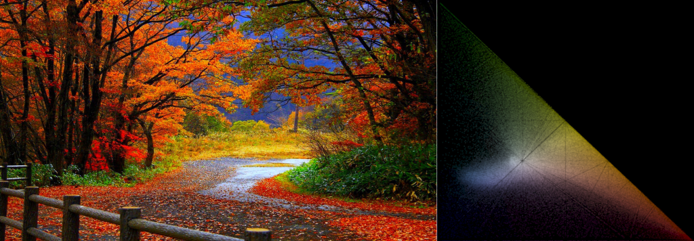
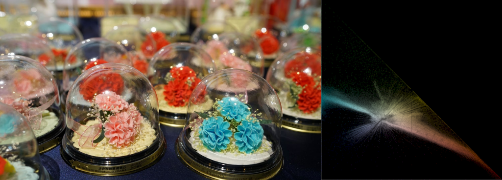
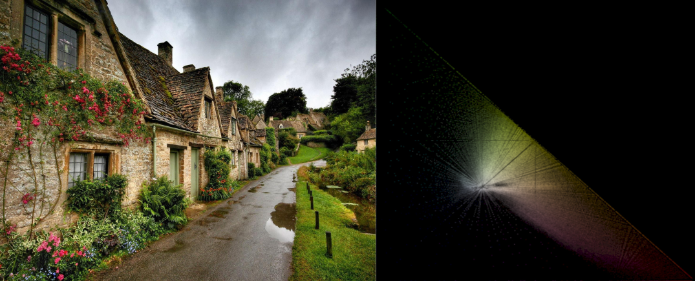
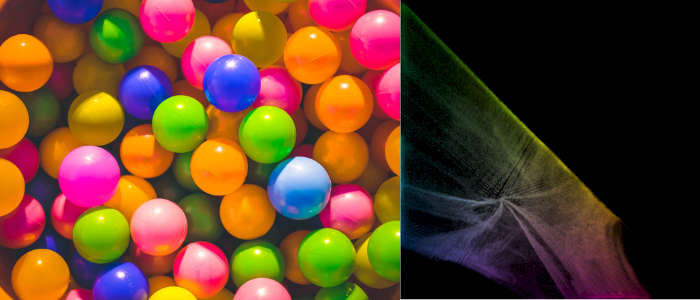
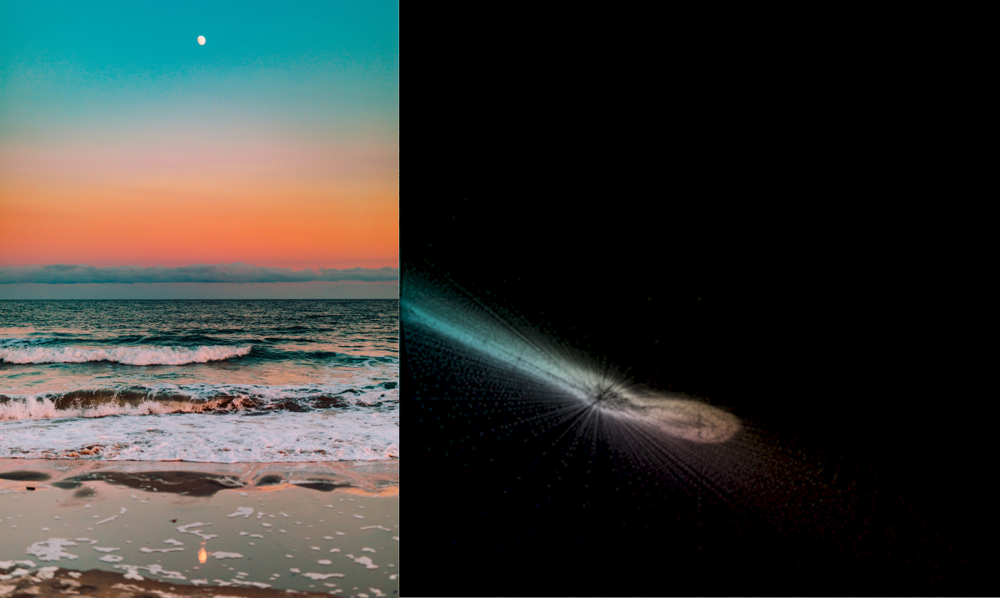

# rg histogram drawer
A simple script to generate an image's rg histogram.

> What is rg chromaticity?
> Find out [here](https://en.wikipedia.org/wiki/Rg_chromaticity).

## Setup
```bash
# Clone project
git clone https://github.com/janos-gonye/rg-hist.git
# Create virtualenv
virtualenv -p python3 venv
# Activate it
source venv/bin/activate
# Install requirements
pip install -r requirements.txt
# Run command
python3 rg_hist.py <path-to-an-image>
# Use -h for help
python3 rg_hist.py --help
```

## Example






